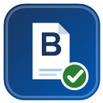

# Pam Beesly – Tebligat Asistanı

UYAP Avukat Portal'daki tebligat barkodlarını tek tıkla sorgulayan Chrome eklentisi.

| Durum | Görünüm |
|---|---|
| Sorgu başarılı |  |
| Kayıt bulunamadı |  |
| Giriş başarılı |  |

## Özellikler

- **Otomatik barkod algılama:** UYAP sayfasındaki `4xx`, `TB…` ve `5xx` kodları (bitişik veya aralıklı yazım dahil) listelenir; araç çubuğu ikonunda sayı rozeti belirir
- **PTT sorgusu (4xx / TB):** son durum + tüm gönderi hareketleri (tarih, saat, işyeri)
- **UETS sorgusu (5xx):** tüm kanıtlar (kabul / teslim / okunma / kanuni tebliğ) ve zamanları
- **Hızlı erişim:** barkodu seç + sağ tık → *Beesly ile sorgula*, veya `Ctrl+Shift+Y` (değiştirilebilir)
- **Eklenti içi UETS girişi:** kullanıcı kodu + şifre + güvenlik kodu + SMS onayı; e-Devlet/e-İmza için siteye yönlendirme
- **Temiz çalışma:** sorgu sekmeleri iş bitince otomatik kapanır, UYAP odağı kaybolmaz, barkod tek tıkla panoya kopyalanır
- **The Office temalı arayüz** (Dunder Mifflin · PTT Şubesi)

## Nasıl çalışır?

| Kod | Kaynak | Yöntem |
|---|---|---|
| `4…` (13 hane), `TB…` | PTT | `ptt.gov.tr` altyapısı üzerinden resmi sorgu API'si (Cloudflare Turnstile doğrulamalı) |
| `5…` (13 hane) | UETS (e-Tebligat) | `api.etebligat.gov.tr` üzerinden oturumlu sorgu |

## Kurulum

1. `chrome://extensions` adresini açın, sağ üstten **Geliştirici modu**'nu etkinleştirin
2. **Paketlenmemiş öğe yükle** → eklenti klasörünü seçin
3. UYAP'ta barkodlu bir sayfayı açın; ikonda sayı rozeti belirecek
4. Kısayolu değiştirmek için: `chrome://extensions/shortcuts`
5. UETS sorgusu için popup'taki **Giriş Yap** formundan bir kez giriş yapın (SMS kodu gelebilir)

## Veri Güvenliği ve Gizlilik

Bu bölüm özellikle meslektaşlarımız için ayrıntılı yazılmıştır. Özet: **eklenti kişisel veri toplamaz, izlemez, dışarıya veri göndermez.**

### Trafik nereye gidiyor?

| İşlem | Hedef adres | Giden veri |
|---|---|---|
| PTT sorgusu | `api.ptt.gov.tr`, `www.ptt.gov.tr` | Yalnızca barkod numarası |
| UETS sorgusu | `api.etebligat.gov.tr`, `ptt.etebligat.gov.tr` | Barkod + oturum jetonu |
| UETS girişi | `api.etebligat.gov.tr` | Kullanıcı kodu + şifre + güvenlik/SMS kodu (yalnızca giriş anında) |
| Başka hiçbir adrese istek yapılmaz | — | GIF'ler dahil tüm görseller eklenti paketinin içindedir |

### Cihazda ne saklanıyor?

| Veri | Nerede | Süre / amaç |
|---|---|---|
| UETS oturum jetonu | Tarayıcı oturum deposu (+ yeniden başlatmaya dayanıklı yedek) | Sorgular için; Çıkış ile silinir |
| Son sorgu sonuçları | Cihaz içi önbellek | Popup'ta hızlı gösterim için |
| Rozet/bağlantı bayrakları | Cihaz içi önbellek | Arayüz durumu için |

### Asla yapılmayanlar

- **Şifre saklanmaz:** giriş anında bellekte tutulur, işlem bitince silinir
- **UYAP içeriği saklanmaz/iletilmez:** sayfa yalnızca barkod deseni için taranır
- **İzleme yok:** analitik, telemetri, reklam, üçüncü taraf çerez yok
- **Uzak kod yok:** eklenti yalnızca paketteki kodu çalıştırır

### İzinler neden gerekli?

| İzin | Gerekçe |
|---|---|
| `activeTab`, `scripting`, `tabs`, `*.uyap.gov.tr` | Barkodları okumak ve seçimi almak için |
| `storage` | Oturum ve sonuç önbelleği için |
| `clipboardWrite` | Barkodu panoya kopyalamak için |
| `contextMenus` | Sağ-tık kısayolu için |
| `alarms` | Boşta kalan sorgu sekmesini kapatmak için |

Kodun tamamı bu depoda açıktır; tarayıcının Geliştirici Araçları → Ağ sekmesinden trafiği kendiniz de denetleyebilirsiniz.

> ⚖️ **Hukuki not:** Eklenti sonuçları bilgilendirme amaçlıdır. Tebligatın hukuki geçerliliği için PTT ve UETS'in resmi kayıtları esastır.

## Sık Sorulan Sorular

**Şifrem nereye gidiyor?**
Yalnızca UETS'in resmi giriş adresine, giriş anında. Eklentide, dosyada veya başka sunucuda saklanmaz.

**UYAP'taki müvekkil dosyalarım okunuyor mu?**
Hayır. Sayfa metni yalnızca `4/5/TB` barkod deseni için taranır; dosya içeriği kopyalanmaz, saklanmaz, iletilmez.

**Neden bu kadar izin istiyor?**
Tablodaki gerekçelere bakın; her izin tek bir işleve bağlıdır, fazlası yoktur.

**Sorgu çalışmazsa ne yapmalıyım?**
Sonuç kutusundaki `İz:` satırı hangi adımın takıldığını söyler. UETS için formdaki **Bağlantıyı Test Et** düğmesi oturumu denetler. Çoğu sorun eklentiyi `chrome://extensions` sayfasından yenileyince çözülür.

**e-Devlet ile giriş yapabilir miyim?**
Evet. Popup'taki **Bağlan** düğmesi UETS giriş sayfasını açar; e-Devlet/e-İmza/Mobil İmza ile giriş yapabilirsiniz.

## Sürüm

v1.0 — PTT + UETS sorgulama, rozet, sağ-tık/kısayol, eklenti içi giriş, Office teması.

## Destek

Hata ve öneriler için GitHub **Issues** sekmesini kullanın.
